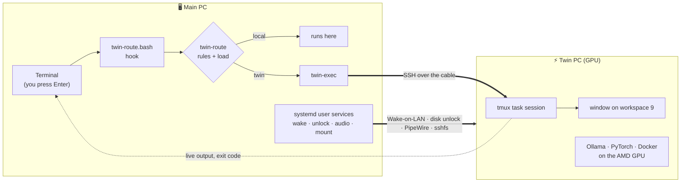

<div align="center">

# 🖥️⚡🖥️ twinPC

### Your second PC becomes your main PC's GPU.

**Type `ollama run …` on one machine — it runs on the other machine's GPU.**<br>
One ethernet cable. No cloud, no cluster, no new habits.


[Features](#-features) · [How it works](#-how-it-works) · [Quick start](#-quick-start) · [Commands](#-command-cheat-sheet) · [Configuration](#%EF%B8%8F-configuration) · [Troubleshooting](#-troubleshooting)

</div>

---

## 💡 Why

You have a powerful workstation — and an older PC with a decent GPU gathering dust. Normally
using both means SSH sessions, copying files around and remembering which machine does what.

**twinPC makes the second machine feel like part of the first.** Keep working in your usual
terminal: GPU and AI work quietly runs on the *twin*, the output streams back to you, and the twin
powers on, unlocks, shares its screen, mouse and sound, and shuts down — all from your main PC.

## ✨ Features

<table>
<tr>
<td width="50%" valign="top">

### 🧠 Automatic task routing
Press Enter as usual. `ollama`, `*train*.py`, `whisper`, `torchrun`… run on the twin's GPU
automatically. Live output, **Ctrl-C and exit codes work as if it were local**, and your shell
history stays clean.

</td>
<td width="50%" valign="top">

### ⚡ One-command power
The twin **wakes with your PC** (Wake-on-LAN), its **encrypted disk is unlocked from your
PC**, and it shuts down with you — unless a job is still running.

</td>
</tr>
<tr>
<td valign="top">

### 🖱️ One desk, two computers
Push the mouse off your screen's edge onto the twin's monitor. No monitor on the twin?
**Super+F12** shows its desktop fullscreen.

</td>
<td valign="top">

### 🔊 Shared sound
The twin plays through **your main PC's speakers** — Bluetooth included — and reconnects by
itself after a reboot or disconnect.

</td>
</tr>
<tr>
<td valign="top">

### 🛠️ The `twin` command
Background jobs, Claude Code agents, GPU stats, file sync, GUI control — one command
with a full manual (`man twin`).

</td>
<td valign="top">

### 🔒 Private by design
Everything runs **over a direct cable**, and jobs, audio and the remote desktop travel
**inside SSH** — no cloud service, no open remote-desktop or audio ports.

</td>
</tr>
</table>

## 🎬 What it looks like

```console
$ ollama run gemma3:4b "Explain LoRA in one sentence"
→ twin (always:ollama)
LoRA (Low-Rank Adaptation) is a technique that allows you to fine-tune large language models by
only training a small number of additional parameters, significantly reducing computational costs…

$ twin gpu
GPU busy: 98%   VRAM: 4308 / 8176 MiB
Temp: 58°C
ollama: gemma3:4b    a2af6cc3eb7f    2.9 GB    100% GPU     4096       29 minutes from now

$ twin route explain make      # CPU work stays on your (faster, idle) main PC
local load-ok:make cpu=0% ram=19%
```

## 🧭 How it works



**The routing rules, in plain words:**

| The command… | Runs on |
|---|---|
| uses the GPU or AI tools (`ollama`, `whisper`, `*train*.py`, `torchrun`, `claude -p`, …) | 🟢 **twin** |
| is typed inside `~/twin/…` (the twin's `~/work`, mounted on your PC) | 🟢 **twin** |
| is CPU-heavy (`make`, `pytest`, `ffmpeg`, …) **and** your PC is above 80 % CPU / 85 % RAM | 🟢 **twin** |
| is anything else — `git`, editors, `sudo`, aliases, functions, … | 🔵 **your PC** |

Twin off? You're asked: **[h]ere / [w]ake twin / [c]ancel**.

## 🚀 Quick start

> **You need:** a main PC running Linux + GNOME, a second PC running [Omarchy](https://omarchy.org)
> (Arch + Hyprland) with an AMD GPU, and one ethernet cable between them.

```bash
# 1 · connect: main PC wired connection → IPv4 → "Shared to other computers"; then on the twin:
sudo pacman -S --needed openssh && sudo systemctl enable --now sshd && sudo ufw allow 22/tcp

# 2 · on the main PC
git clone https://github.com/<you>/twinPC ~/projects/twinPC && cd ~/projects/twinPC
ssh-copy-id <twin-user>@10.42.0.11

# 3 · set up the twin (asks for the twin's sudo password), then reboot it
scp -r twinpc <twin-user>@10.42.0.11:twinpc-setup
ssh -t <twin-user>@10.42.0.11 'sudo bash ~/twinpc-setup/install.sh && sudo reboot'

# 4 · set up the main PC
mkdir -p ~/.config/twinpc && printf 'TWIN_USER=<twin-user>\nTWIN_MAC=<twin-mac>\n' > ~/.config/twinpc/config
bash main/install.sh
```

Open a new terminal and try `twin status` → `ollama run gemma3:4b hi` 🎉

<details>
<summary><b>📋 Step-by-step installation (with explanations)</b></summary>

### 1. Connect the machines
1. Plug the ethernet cable into both PCs.
2. On the main PC: wired connection settings → IPv4 → **Shared to other computers**. The twin
   gets an address in `10.42.0.x` and internet through your PC.
3. On the twin, enable SSH:
   ```bash
   sudo pacman -S --needed openssh
   sudo systemctl enable --now sshd
   sudo ufw allow 22/tcp
   ```
4. On the main PC, clone the project and install your SSH key on the twin:
   ```bash
   git clone https://github.com/<you>/twinPC ~/projects/twinPC
   ssh-copy-id <twin-user>@<twin-ip>
   ```

### 2. Enable Wake-on-LAN in the twin's BIOS
On ASUS boards: **Advanced → APM Configuration** → *ErP Ready* = Disabled,
*Power On By PCI-E* = Enabled. Optional: *Restore AC Power Loss* = Power On.

### 3. Set up the twin
```bash
scp -r twinpc <twin-user>@<twin-ip>:twinpc-setup
ssh <twin-user>@<twin-ip>
sudo bash ~/twinpc-setup/install.sh        # packages, Ollama (ROCm), Wake-on-LAN, GUI tools, remote unlock
bash ~/twinpc-setup/setup-ai-env.sh        # optional: PyTorch for ROCm in ~/ai-env (~4 GB)
sudo reboot
```
Each step in `twinpc/` is a separate script and can be re-run safely.

### 4. Set up the main PC
```bash
sudo apt install sshfs remmina             # or your distribution's equivalent
mkdir -p ~/.config/twinpc
cat > ~/.config/twinpc/config <<'EOF'
TWIN_USER=<twin-user>                      # your user on the twin
TWIN_MAC=<twin-mac-address>                # twin's wired MAC, for Wake-on-LAN (ip link on the twin)
EOF
bash ~/projects/twinPC/main/install.sh
```
The installer needs no `sudo`, only writes files whose content differs and can be re-run any
time. It sets up the `twin` command and manual, SSH aliases, user services, the Super+F12
shortcut, lan-mouse on both machines, the twin's audio output and the task-routing hook. If your
wired card is an Intel I225-V, it also prints an optional `sudo` command that stops that card
from hanging.

</details>

## 📖 Command cheat sheet

| Command | What it does |
|---|---|
| `twin status` · `twin wake` · `twin off` · `twin reboot` | power — wake/reboot ask for the disk password |
| `twin run <name> '<cmd>'` · `twin logs <name> -f` | background job on the twin and its output |
| `twin claude <name> <dir>` · `twin cc <name> <dir> "<task>"` | Claude Code on the twin, interactive or headless |
| `twin gpu` · `twin top` · `twin models` | what the twin is doing |
| `twin route status` · `twin route explain <cmd>` · `twin route off` | automatic routing |
| `local <cmd>` · `twin-exec -- <cmd>` | force one command here / on the twin |
| `twin desktop` (**Super+F12**) · `twin gui shot` | see the twin's screen |
| `twin push <dir>` · `twin pull <path>` | copy files |
| `twin audio test` | play a tone on the twin through your speakers |

Full reference: **`man twin`**.

## ⚙️ Configuration

Machine settings live in **`~/.config/twinpc/config`** (plain `NAME=value` lines); routing rules
live in **`~/.config/twin-route/rules.toml`**.

| Setting | Where | Default |
|---|---|---|
| Your user on the twin | `TWIN_USER` | — *set it* |
| Twin's MAC (Wake-on-LAN) | `TWIN_MAC` | — *set it* |
| SSH host alias | `TWIN_HOST` | `twin` |
| This PC's wired port | `TWIN_IFACE` | auto-detected |
| Headless screen size | `TWIN_HEADLESS_MODE` | `2560x1080@60` |
| Remote-desktop local port | `TWIN_VNC_PORT` | `5901` |
| Commands that go to the twin | `rules.toml` → `always_twin`, `never_twin`, `load_offload`, `needs_cwd` | GPU/AI tools |
| Load thresholds | `rules.toml` → `[load]` | CPU 80 %, RAM 85 % |
| Shared workspace | `rules.toml` → `[workspace]` | `~/twin` ⇄ twin `~/work` |
| Routing off for one shell | `TWIN_ROUTE=off` | on |

## 🩺 Troubleshooting

<details>
<summary><b>Nothing reaches the twin</b></summary>

Check the main PC's wired port too. If `/sys/class/net/<iface>/statistics/tx_packets` stops
increasing while you `ping` the twin, the main PC's network card is stuck — reload its driver
(`sudo modprobe -r igc && sudo modprobe igc` for Intel I225) or reboot.
</details>

<details>
<summary><b>No sound from the twin</b></summary>

`twin audio heal`, then `twin audio test`. The upkeep timer runs `heal` every 20 s anyway.
</details>

<details>
<summary><b>The twin waits at its disk-encryption prompt</b></summary>

Run `twin unlock` in a terminal and type the disk password.
</details>

<details>
<summary><b>The twin's screen is locked</b></summary>

`twin unlock-screen` types your login password into the lock screen.
</details>

<details>
<summary><b><code>~/twin</code> is empty</b></summary>

The twin is off or the mount dropped: `twin wake`, or `systemctl --user restart twin-mount`.
</details>

<details>
<summary><b>Routing gets in the way</b></summary>

`local <command>` for one command, `twin route off` for all of them.
</details>

## 🗂️ Project layout

```
twin · twin-completion.bash · man/   the twin command, tab completion and manual
route/                               automatic task routing — router, rules, runner, bash hook
main/                                main-PC services and settings · main/install.sh
twinpc/                              twin setup scripts · twinpc/install.sh · setup-ai-env.sh
tests/                               54 unit & integration tests + system checks
docs/                                design notes
```

## 🧪 Tests

```bash
python3 -m unittest tests.test_twin_route tests.test_hook   # fast, local
python3 -m unittest tests.test_twin_exec                    # needs the twin running
for t in tests/*.sh; do bash "$t"; done                     # system checks
```

---

<div align="center">

**If twinPC saves you from buying a new GPU, give it a ⭐**

</div>
